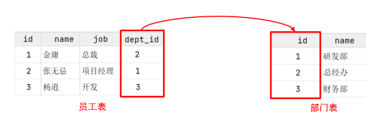
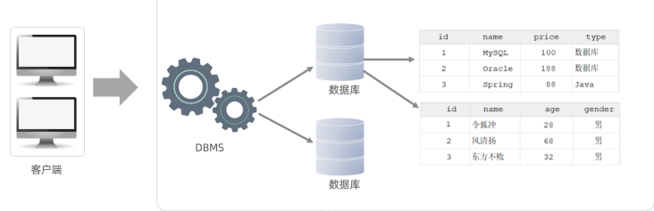
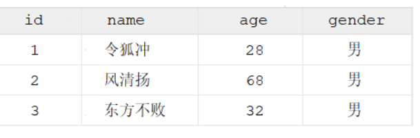
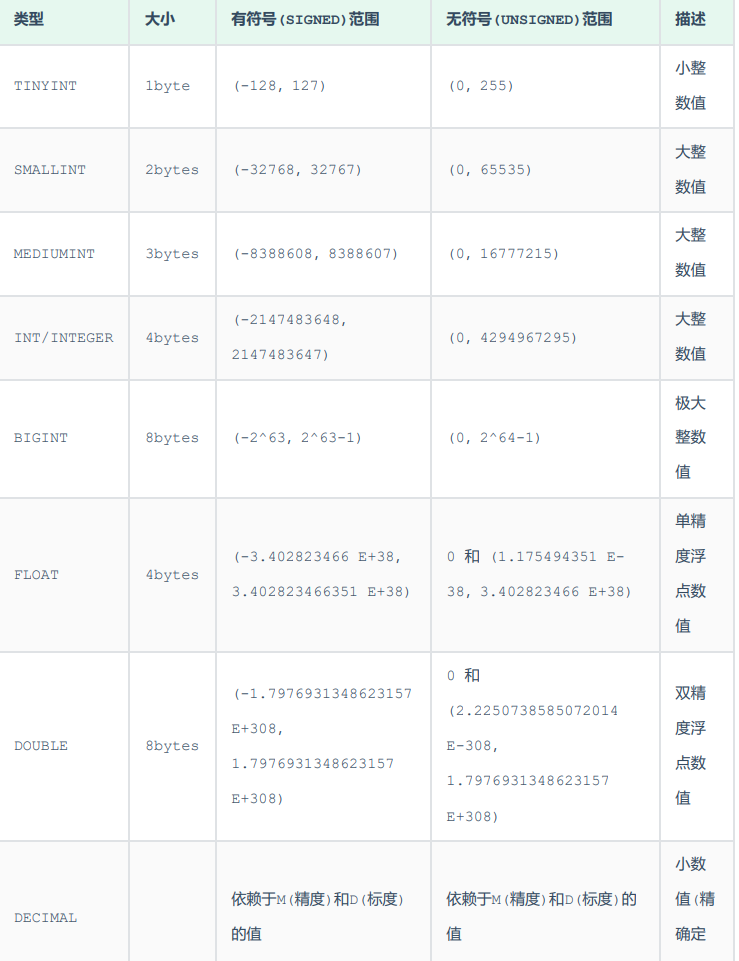
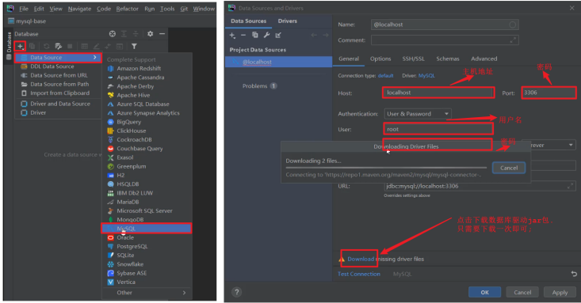

# 2、基础语法

[TOC]


## 1、数据模型

1). 关系型数据库（RDBMS）
概念：建立在关系模型基础上，由多张相互连接的二维表组成的数据库。
而所谓二维表，指的是由行和列组成的表，如下图（就类似于Excel表格数据，有表头、有列、有行，
还可以通过一列关联另外一个表格中的某一列数据）。我们之前提到的MySQL、Oracle、DB2、
SQLServer这些都是属于关系型数据库，里面都是基于二维表存储数据的。简单说，基于二维表存储
数据的数据库就成为关系型数据库，不是基于二维表存储数据的数据库，就是非关系型数据库。



特点：
A. 使用表存储数据，格式统一，便于维护。
B. 使用SQL语言操作，标准统一，使用方便。

MySQL是关系型数据库，是基于二维表进行数据存储的，具体的结构图下:



我们可以通过MySQL客户端连接数据库管理系统DBMS，然后通过DBMS操作数据库。
可以使用SQL语句，通过数据库管理系统操作数据库，以及操作数据库中的表结构及数据。
一个数据库服务器中可以创建多个数据库，一个数据库中也可以包含多张表，而一张表中又可以包
含多行记录。

## 2、SQL

全称 Structured Query Language，结构化查询语言。操作关系型数据库的编程语言，定义了
一套操作关系型数据库统一标准 。

### SQL通用语法

在学习具体的SQL语句之前，先来了解一下SQL语言的同于语法。

```
1). SQL语句可以单行或多行书写，以分号结尾。
2). SQL语句可以使用空格/缩进来增强语句的可读性。
3). MySQL数据库的SQL语句不区分大小写，关键字建议使用大写。
4). 注释：
单行注释：-- 注释内容 或 # 注释内容
多行注释：/* 注释内容 */
```

## 3、SQL分类

SQL语句，根据其功能，主要分为四类：DDL、DML、DQL、DCL

| 分类   | 全称                        | 说明                          |
| ---- | ------------------------- | --------------------------- |
| DDL  | Data DefinitionLanguage   | 数据定义语言，用来定义数据库对象(数据库，表，字段)  |
| DML  | Data ManipulationLanguage | 数据操作语言，用来对数据库表中的数据进行增删改     |
| DQL  | Data Query Language       | 数据查询语言，用来查询数据库中表的记录         |
| DCL  | Data Control Language     | 数据控制语言，用来创建数据库用户、控制数据库的访问权限 |

## 4、DDL

### 数据库操作：

#### 1). 查询所有数据库

```
show databases ;
```

#### 2). 查询当前数据库

```
select database() ;
```

#### 3). 创建数据库

```
create database [ if not exists ] 数据库名 [ default charset 字符集 ] [ collate 排序
规则 ] ;
```

```
案例：
创建一个itcast数据库, 使用数据库默认的字符集。
 create database itcast;
在同一个数据库服务器中，不能创建两个名称相同的数据库，否则将会报错。
可以通过if not exists 参数来解决这个问题，数据库不存在, 则创建该数据库，如果存在，则不
创建。
create database if not extists itcast;
创建一个itheima数据库，并且指定字符集
create database itheima default charset utf8mb4;
```

#### 4). 删除数据库

```
drop database [ if exists ] 数据库名 ;
```

如果删除一个不存在的数据库，将会报错。此时，可以加上参数 if exists ，如果数据库存在，再
执行删除，否则不执行删除。

5). 切换数据库
我们要操作某一个数据库下的表时，就需要通过该指令，切换到对应的数据库下，否则是不能操作的。
比如，切换到itcast数据，执行如下SQL：

```
use itcast;
```

###  表操作

####  1、表操作-查询创建

##### 1). 查询当前数据库所有表

```
show tables;
```

比如,我们可以切换到sys这个系统数据库,并查看系统数据库中的所有表结构。

```
use sys;
show tables;
```

##### 2). 查看指定表结构

```
desc 表名 ;
```

通过这条指令，我们可以查看到指定表的字段，字段的类型、是否可以为NULL，是否存在默认值等信
息。

##### 3). 查询指定表的建表语句

```
show create table 表名 ;
```

通过这条指令，主要是用来查看建表语句的，而有部分参数我们在创建表的时候，并未指定也会查询
到，因为这部分是数据库的默认值，如：存储引擎、字符集等。

##### 4). 创建表结构

```
CREATE TABLE 表名(
字段1 字段1类型 [ COMMENT 字段1注释 ],
字段2 字段2类型 [COMMENT 字段2注释 ],
字段3 字段3类型 [COMMENT 字段3注释 ],
......
字段n 字段n类型 [COMMENT 字段n注释 ]
) [ COMMENT 表注释 ] ;
```

注意: [...] 内为可选参数，最后一个字段后面没有逗号

比如，我们创建一张表 tb_user ，对应的结构如下，那么建表语句为：



```
create table tb_user(
id int comment '编号',
name varchar(50) comment '姓名',
age int comment '年龄',
gender varchar(1) comment '性别'
) comment '用户表';
```

#### 2、表操作-数据类型

在上述的建表语句中，我们在指定字段的数据类型时，用到了int ，varchar，那么在MySQL中除了
以上的数据类型，还有哪些常见的数据类型呢？ 接下来,我们就来详细介绍一下MySQL的数据类型。
MySQL中的数据类型有很多，主要分为三类：数值类型、字符串类型、日期时间类型。

##### 1). 数值类型



```
如:
1). 年龄字段 -- 不会出现负数, 而且人的年龄不会太大
age tinyint unsigned
2). 分数 -- 总分100分, 最多出现一位小数
score double(4,1)
```

##### 2). 字符串类型

| 类型         | 大小                    | 描述              |
| ---------- | --------------------- | --------------- |
| CHAR       | 0-255 bytes           | 定长字符串(需要指定长度)   |
| VARCHAR    | 0-65535 bytes         | 变长字符串(需要指定长度)   |
| TINYBLOB   | 0-255 bytes           | 不超过255个字符的二进制数据 |
| TINYTEXT   | 0-255 bytes           | 短文本字符串          |
| BLOB       | 0-65 535 bytes        | 二进制形式的长文本数据     |
| TEXT       | 0-65 535 bytes        | 长文本数据           |
| MEDIUMBLOB | 0-16 777 215 bytes    | 二进制形式的中等长度文本数据  |
| MEDIUMTEXT | 0-16 777 215 bytes    | 中等长度文本数据        |
| LONGBLOB   | 0-4 294 967 295 bytes | 二进制形式的极大文本数据    |
| LONGTEXT   | 0-4 294 967 295 bytes | 极大文本数据          |

char 与 varchar 都可以描述字符串，char是定长字符串，指定长度多长，就占用多少个字符，和
字段值的长度无关 。而varchar是变长字符串，指定的长度为最大占用长度 。相对来说，char的性
能会更高些。

```
如：
1). 用户名 username ------> 长度不定, 最长不会超过50
username varchar(50)
2). 性别 gender ---------> 存储值, 不是男,就是女
gender char(1)
3). 手机号 phone --------> 固定长度为11
phone char(11)
```

##### 3). 日期时间类型

| 类型        | 大小   | 范围                                       | 格式                 | 描述           |
| --------- | ---- | ---------------------------------------- | ------------------ | ------------ |
| DATE      | 3    | 1000-01-01 至 9999-12-31                  | YYYY-MM-DD         | 日期值          |
| TIME      | 3    | -838:59:59 至 838:59:59                   | HH:MM:SS           | 时间值或持续时间     |
| YEAR      | 1    | 1901 至 2155                              | YYYY               | 年份值          |
| DATETIME  | 8    | 1000-01-01 00:00:00 至9999-12-31 23:59:59 | YYYY-MM-DDHH:MM:SS | 混合日期和时间值     |
| TIMESTAMP | 4    | 1970-01-01 00:00:01 至2038-01-19 03:14:07 | YYYY-MM-DDHH:MM:SS | 混合日期和时间值，时间戳 |

```
如:
1). 生日字段 birthday
birthday date
2). 创建时间 createtime
createtime datetime
```

#### 3、 表操作-案例

```
设计一张员工信息表，要求如下：
1. 编号（纯数字）
2. 员工工号 (字符串类型，长度不超过10位)
3. 员工姓名（字符串类型，长度不超过10位）
4. 性别（男/女，存储一个汉字）
5. 年龄（正常人年龄，不可能存储负数）
6. 身份证号（二代身份证号均为18位，身份证中有X这样的字符）
7. 入职时间（取值年月日即可）
对应的建表语句如下:
create table emp(
id int comment '编号',
workno varchar(10) comment '工号',
name varchar(10) comment '姓名',
gender char(1) comment '性别',
age tinyint unsigned comment '年龄',
idcard char(18) comment '身份证号',
entrydate date comment '入职时间'
) comment '员工表';
```

#### 4、表操作-修改

##### 1). 添加字段

```
 ALTER TABLE 表名 ADD 字段名 类型 (长度) [ COMMENT 注释 ] [ 约束 ];
```

案例:
为emp表增加一个新的字段”昵称”为nickname，类型为varchar(20)	

```
ALTER TABLE emp ADD nickname varchar(20) COMMENT '昵称';
```

##### 2). 修改数据类型

```
ALTER TABLE 表名 MODIFY 字段名 新数据类型 (长度);
```

##### 3). 修改字段名和字段类型

```
ALTER TABLE 表名 CHANGE 旧字段名 新字段名 类型 (长度) [ COMMENT 注释 ] [ 约束 ];
```

案例:
将emp表的nickname字段修改为username，类型为varchar(30)

```
ALTER TABLE emp CHANGE nickname username varchar(30) COMMENT '昵称';
```

##### 4). 删除字段

```
ALTER TABLE 表名 DROP 字段名;
```

案例:
将emp表的字段username删除

```
ALTER TABLE emp DROP username;
```

##### 5). 修改表名

```
ALTER TABLE 表名 RENAME TO 新表名;
```

案例:
将emp表的表名修改为 employee

```
ALTER TABLE emp RENAME TO employee;
```

#### 5、表操作-删除

##### 1). 删除表

```
DROP TABLE [ IF EXISTS ] 表名;
```

可选项 IF EXISTS 代表，只有表名存在时才会删除该表，表名不存在，则不执行删除操作(如果不
加该参数项，删除一张不存在的表，执行将会报错)。
案例:
如果tb_user表存在，则删除tb_user表

```
DROP TABLE IF EXISTS tb_user;
```

##### 2). 删除指定表, 并重新创建表

```
TRUNCATE TABLE 表名;
```

**注意: 在删除表的时候，表中的全部数据也都会被删除**。

## 5、datadrip链接数据库




配置以及驱动jar包下载完毕之后，就可以点击 "Test Connection" 就可以测试，是否可以连接
MySQL，如果出现 "Successed"，就表名连接成功了 。

## 6、DML

DML英文全称是Data Manipulation Language(数据操作语言)，用来对数据库中表的数据记录进
行增、删、改操作。

### 1、添加数据

#### 1). 给指定字段添加数据

```
INSERT INTO 表名 (字段名1, 字段名2, ...) VALUES (值1, 值2, ...);
```

案例: 给employee表所有的字段添加数据 ；

```
insert into employee(id,workno,name,gender,age,idcard,entrydate)
values(1,'1','Itcast','男',10,'123456789012345678','2000-01-01');
```

查询数据库的数据：

直接一条查询数据的SQL语句, 语句如下:

```
select * from employee;
```

案例: 给employee表所有的字段添加数据
执行如下SQL，添加的年龄字段值为-1。

```
insert into employee(id,workno,name,gender,age,idcard,entrydate)
values(1,'1','Itcast','男',-1,'123456789012345678','2000-01-01');
```

执行上述的SQL语句时，就会报错。

因为 employee 表的age字段类型为 tinyint，而且还是无符号的 unsigned ，所以取值只能在
0-255 之间。

#### 2). 给全部字段添加数据

```
INSERT INTO 表名 VALUES (值1, 值2, ...);
```

案例：插入数据到employee表，具体的SQL如下：

```
insert into employee values(2,'2','张无忌','男',18,'123456789012345670','2005-01-01');
```

#### 3). 批量添加数据

```
INSERT INTO 表名 (字段名1, 字段名2, ...) VALUES (值1, 值2, ...), (值1, 值2, ...), (值
1, 值2, ...) ;
INSERT INTO 表名 VALUES (值1, 值2, ...), (值1, 值2, ...), (值1, 值2, ...) ;
```

案例：批量插入数据到employee表，具体的SQL如下：

```
insert into employee values(3,'3','韦一笑','男',38,'123456789012345670','2005-01-
01'),(4,'4','赵敏','女',18,'123456789012345670','2005-01-01');
```

注意：

•插入数据时，指定的字段顺序需要与值的顺序是一一对应的

• 字符串和日期型数据应该包含在引号中。

• 插入的数据大小，应该在字段的规定范围内。

### 2、修改数据

修改数据的具体语法为:

```
UPDATE 表名 SET 字段名1 = 值1 , 字段名2 = 值2 , .... [ WHERE 条件 ] ;
```

案例:

```
修改id为1的数据，将name修改为itheima
update employee set name = 'itheima' where id = 1;
修改id为1的数据, 将name修改为小昭, gender修改为 女
update employee set name = '小昭' , gender = '女' where id = 1;
将所有的员工入职日期修改为 2008-01-01
update employee set entrydate = '2008-01-01';

```

**注意：修改语句的条件可以有，也可以没有，如果没有条件，则会修改整张表的所有数据。**

### 3、删除数据

删除数据的具体语法为：

```
DELETE FROM 表名 [ WHERE 条件 ] ;
```

案例:
 删除gender为女的员工

```
delete from employee where gender = '女';
```

删除所有员工

```
delete from employee;
```

注意：

• DELETE 语句的条件可以有，也可以没有，如果没有条件，则会删除整张表的所有数
据。
• DELETE 语句不能删除某一个字段的值(可以使用UPDATE，将该字段值置为NULL即
可)。
• 当进行删除全部数据操作时，datagrip会提示我们，询问是否确认删除，我们直接点击
Execute即可。

## 7、DQL

DQL英文全称是Data Query Language(数据查询语言)，数据查询语言，用来查询数据库中表的记
录。
查询关键字: SELECT
在一个正常的业务系统中，查询操作的频次是要远高于增删改的，当我们去访问企业官网、电商网站，
在这些网站中我们所看到的数据，实际都是需要从数据库中查询并展示的。而且在查询的过程中，可能
还会涉及到条件、排序、分页等操作。	

首先完成如下数据准备工作:

```mysql
drop table if exists employee;
create table emp(
id int comment '编号',
workno varchar(10) comment '工号',
name varchar(10) comment '姓名',
gender char(1) comment '性别',
age tinyint unsigned comment '年龄',
idcard char(18) comment '身份证号',
workaddress varchar(50) comment '工作地址',
entrydate date comment '入职时间'
)comment '员工表';
INSERT INTO emp (id, workno, name, gender, age, idcard, workaddress, entrydate)
VALUES (1, '00001', '柳岩666', '女', 20, '123456789012345678', '北京', '2000-01-
01');
INSERT INTO emp (id, workno, name, gender, age, idcard, workaddress, entrydate)
VALUES (2, '00002', '张无忌', '男', 18, '123456789012345670', '北京', '2005-09-
01');
INSERT INTO emp (id, workno, name, gender, age, idcard, workaddress, entrydate)
VALUES (3, '00003', '韦一笑', '男', 38, '123456789712345670', '上海', '2005-08-
01');
INSERT INTO emp (id, workno, name, gender, age, idcard, workaddress, entrydate)
VALUES (4, '00004', '赵敏', '女', 18, '123456757123845670', '北京', '2009-12-01');
INSERT INTO emp (id, workno, name, gender, age, idcard, workaddress, entrydate)
VALUES (5, '00005', '小昭', '女', 16, '123456769012345678', '上海', '2007-07-01');
INSERT INTO emp (id, workno, name, gender, age, idcard, workaddress, entrydate)
VALUES (6, '00006', '杨逍', '男', 28, '12345678931234567X', '北京', '2006-01-01');
INSERT INTO emp (id, workno, name, gender, age, idcard, workaddress, entrydate)
VALUES (7, '00007', '范瑶', '男', 40, '123456789212345670', '北京', '2005-05-01');
INSERT INTO emp (id, workno, name, gender, age, idcard, workaddress, entrydate)
VALUES (8, '00008', '黛绮丝', '女', 38, '123456157123645670', '天津', '2015-05-
01');
INSERT INTO emp (id, workno, name, gender, age, idcard, workaddress, entrydate)
VALUES (9, '00009', '范凉凉', '女', 45, '123156789012345678', '北京', '2010-04-
01');
INSERT INTO emp (id, workno, name, gender, age, idcard, workaddress, entrydate)
VALUES (10, '00010', '陈友谅', '男', 53, '123456789012345670', '上海', '2011-01-
01');
INSERT INTO emp (id, workno, name, gender, age, idcard, workaddress, entrydate)
VALUES (11, '00011', '张士诚', '男', 55, '123567897123465670', '江苏', '2015-05-
01');
INSERT INTO emp (id, workno, name, gender, age, idcard, workaddress, entrydate)
VALUES (12, '00012', '常遇春', '男', 32, '123446757152345670', '北京', '2004-02-
01');
INSERT INTO emp (id, workno, name, gender, age, idcard, workaddress, entrydate)
VALUES (13, '00013', '张三丰', '男', 88, '123656789012345678', '江苏', '2020-11-
01');
INSERT INTO emp (id, workno, name, gender, age, idcard, workaddress, entrydate)
VALUES (14, '00014', '灭绝', '女', 65, '123456719012345670', '西安', '2019-05-
01');
INSERT INTO emp (id, workno, name, gender, age, idcard, workaddress, entrydate)
VALUES (15, '00015', '胡青牛', '男', 70, '12345674971234567X', '西安', '2018-04-
01');
INSERT INTO emp (id, workno, name, gender, age, idcard, workaddress, entrydate)
VALUES (16, '00016', '周芷若', '女', 18, null, '北京', '2012-06-01');
```

### 1、基本语法

DQL 查询语句，语法结构如下：

```mysql
SELECT
	字段列表
FROM
	表名列表
WHERE
	条件列表
GROUP BY
	分组字段列表
HAVING
	分组后条件列表
ORDER BY
	排序字段列表
LIMIT
	分页参数
```

将上面的完整语法进行拆分，分为以下几个部分：
基本查询（不带任何条件）
条件查询（WHERE）
聚合函数（count、max、min、avg、sum）
分组查询（group by）
排序查询（order by）
分页查询（limit）

### 2、基础查询

在基本查询的DQL语句中，不带任何的查询条件，查询的语法如下：

#### 1). 查询多个字段

```
SELECT 字段1, 字段2, 字段3 ... FROM 表名 ;
SELECT * FROM 表名 ;
```

注意 : * 号代表查询所有字段，在实际开发中尽量少用（不直观、影响效率）。

#### 2). 字段设置别名

```
SELECT 字段1 [ AS 别名1 ] , 字段2 [ AS 别名2 ] ... FROM 表名;
SELECT 字段1 [ 别名1 ] , 字段2 [ 别名2 ] ... FROM 表名;
```

#### 3). 去除重复记录

```
SELECT DISTINCT 字段列表 FROM 表名;
```

#### 案例：

查询指定字段 name, workno, age并返回

```
select name,workno,age from emp;
```


查询返回所有字段

```
select id ,workno,name,gender,age,idcard,workaddress,entrydate from emp;
select * from emp;
```

查询所有员工的工作地址,起别名

```
select workaddress as '工作地址' from emp;
-- as可以省略
select workaddress '工作地址' from emp;
```

查询公司员工的上班地址有哪些(不要重复)

```
select distinct workaddress '工作地址' from emp;
```

### 3、条件查询

#### 1). 语法

```
SELECT 字段列表 FROM 表名 WHERE 条件列表 ;
```

#### 2). 条件

常用的比较运算符如下:

| 比较运算符               | 功能                      |
| ------------------- | ----------------------- |
| >                   | 大于                      |
| >=                  | 大于等于                    |
| <                   | 小于                      |
| <=                  | 小于                      |
| =                   | 等于                      |
| <> 或 !=             | 不等于                     |
| BETWEEN ... AND ... | 在某个范围之内(含最小、最大值)        |
| IN(...)             | 在in之后的列表中的值，多选一         |
| LIKE 占位符            | 模糊匹配(_匹配单个字符, %匹配任意个字符) |
| IS NULL             | 是NULL                   |

常用的逻辑运算符如下:

| 逻辑运算符     | 功能              |
| --------- | --------------- |
| AND 或 &&  | 并且 (多个条件同时成立)   |
| OR 或 \|\| | 或者 (多个条件任意一个成立) |
| NOT 或 !   | 非 , 不是          |

#### 案例:

A. 查询年龄等于 88 的员工

```
select * from emp where age = 88;
```


B. 查询年龄小于 20 的员工信息

```
 select * from emp where age < 20;
```


C. 查询年龄小于等于 20 的员工信息

```
 select * from emp where age <= 20;
```


D. 查询没有身份证号的员工信息

```
select * from emp where idcard is null;
```


E. 查询有身份证号的员工信息

```
 select * from emp where idcard is not null;
```


F. 查询年龄不等于 88 的员工信息

```
select * from emp where age != 88;
select * from emp where age <> 88;
```


G. 查询年龄在15岁(包含) 到 20岁(包含)之间的员工信息

```
select * from emp where age >= 15 && age <= 20;
select * from emp where age >= 15 and age <= 20;
select * from emp where age between 15 and 20;
```


H. 查询性别为 女 且年龄小于 25岁的员工信息

```
select * from emp where gender = '女' and age < 25;
```


I. 查询年龄等于18 或 20 或 40 的员工信息

```
select * from emp where age = 18 or age = 20 or age =40;
select * from emp where age in(18,20,40);
```


J. 查询姓名为两个字的员工信息 _ %

```
select * from emp where name like '__';
```


K. 查询身份证号最后一位是X的员工信息

```
select * from emp where idcard like '%X';
select * from emp where idcard like '_________________X';
```

### 4、聚合函数

#### 1). 介绍

将一列数据作为一个整体，进行纵向计算 。

#### 2). 常见的聚合函数

| 函数    | 功能   |
| ----- | ---- |
| count | 统计数量 |
| max   | 最大值  |
| min   | 最小值  |
| avg   | 平均值  |
| sum   | 求和   |

#### 3). 语法

```
SELECT 聚合函数(字段列表) FROM 表名 ;
```

注意 : NULL值是不参与所有聚合函数运算的。

案例：

A.统计该企业员工数量

```
select count(*) from emp; -- 统计的是总记录数
select count(idcard) from emp; -- 统计的是idcard字段不为null的记录数
```

对于count聚合函数，统计符合条件的总记录数，还可以通过 count(数字/字符串)的形式进行统计
查询，比如：

```
select count(1) from emp;
```

对于count(*) 、count(字段)、 count(1) 的具体原理，我们在进阶篇中SQL优化部分会详
细讲解，此处大家只需要知道如何使用即可。

B. 统计该企业员工的平均年龄

```
select avg(age) from emp;
```

C. 统计该企业员工的最大年龄

```
select max(age) from emp;
```

D. 统计该企业员工的最小年龄

```
select min(age) from emp;
```

E. 统计西安地区员工的年龄之和

```
select sum(age) from emp where workaddress = '西安';
```

### 5、分组查询

#### 1). 语法

```
SELECT 字段列表 FROM 表名 [ WHERE 条件 ] GROUP BY 分组字段名 [ HAVING 分组
后过滤条件 ];
```

#### 2). where与having区别

执行时机不同：where是分组之前进行过滤，不满足where条件，不参与分组；而having是分组
之后对结果进行过滤。
判断条件不同：where不能对聚合函数进行判断，而having可以。

注意：

• 分组之后，查询的字段一般为聚合函数和分组字段，查询其他字段无任何意义。
• 执行顺序: where > 聚合函数 > having 。
• 支持多字段分组, 具体语法为 : group by columnA,columnB

案例:

A. 根据性别分组 , 统计男性员工 和 女性员工的数量

```
select gender, count(*) from emp group by gender ;
```

B. 根据性别分组 , 统计男性员工 和 女性员工的平均年龄

```
select gender, avg(age) from emp group by gender ;
```

C. 查询年龄小于45的员工 , 并根据工作地址分组 , 获取员工数量大于等于3的工作地址

```
select workaddress, count(*) address_count from emp where age < 45 group by
workaddress having address_count >= 3;
```

D. 统计各个工作地址上班的男性及女性员工的数量

```
select workaddress, gender, count(*) '数量' from emp group by gender , workaddress;
```

### 6、排序查询

​	排序在日常开发中是非常常见的一个操作，有升序排序，也有降序排序。

#### 1). 语法

```
SELECT 字段列表 FROM 表名 ORDER BY 字段1 排序方式1 , 字段2 排序方式2 ;
```

#### 2). 排序方式

ASC : 升序(默认值)
DESC: 降序

注意：

• 如果是升序, 可以不指定排序方式ASC ;
• 如果是多字段排序，当第一个字段值相同时，才会根据第二个字段进行排序 ;

#### 案例:

A. 根据年龄对公司的员工进行升序排序

```
select * from emp order by age asc;
select * from emp order by age;
```

B. 根据入职时间, 对员工进行降序排序

```
select * from emp order by entrydate desc;
```

C. 根据年龄对公司的员工进行升序排序 , 年龄相同 , 再按照入职时间进行降序排序

```
select * from emp order by age asc , entrydate desc;
```

### 7、分页查询

分页操作在业务系统开发时，也是非常常见的一个功能，我们在网站中看到的各种各样的分页条，后台
都需要借助于数据库的分页操作。

#### 1). 语法

```
SELECT 字段列表 FROM 表名 LIMIT 起始索引, 查询记录数 ;
```

注意:
• 起始索引从0开始，起始索引 = （查询页码 - 1）* 每页显示记录数。
• 分页查询是数据库的方言，不同的数据库有不同的实现，MySQL中是LIMIT。
• 如果查询的是第一页数据，起始索引可以省略，直接简写为 limit 10。

#### 案例:

A. 查询第1页员工数据, 每页展示10条记录

```
select * from emp limit 0,10;
select * from emp limit 10;
```

B. 查询第2页员工数据, 每页展示10条记录 --------> (页码-1)*页展示记录数

```
select * from emp limit 10,10;
```

### 8、案例

1). 查询年龄为20,21,22,23岁的员工信息。

```
select * from emp where gender = '女' and age in(20,21,22,23);
```

2). 查询性别为 男 ，并且年龄在 20-40 岁(含)以内的姓名为三个字的员工。

```
select * from emp where gender = '男' and ( age between 20 and 40 ) and name like
```

3). 统计员工表中, 年龄小于60岁的 , 男性员工和女性员工的人数。

```
select gender, count(*) from emp where age < 60 group by gender;
```

4). 查询所有年龄小于等于35岁员工的姓名和年龄，并对查询结果按年龄升序排序，如果年龄相同按

入职时间降序排序。

```
select name , age from emp where age <= 35 order by age asc , entrydate desc;
```

5). 查询性别为男，且年龄在20-40 岁(含)以内的前5个员工信息，对查询的结果按年龄升序排序，

年龄相同按入职时间升序排序。

```
select * from emp where gender = '男' and age between 20 and 40 order by age asc ,
entrydate asc limit 5 ;
```

### 9、执行顺序

DQL语句的执行顺序为： from ... where ... group by ...having ... select ... order by ... limit ...

## 8、DCL

DCL英文全称是Data Control Language(数据控制语言)，用来管理数据库用户、控制数据库的访
问权限。

### 1、管理用户

#### 1). 查询用户

```
select * from mysql.user;
```

#### 2). 创建用户

```
CREATE USER '用户名'@'主机名' IDENTIFIED BY '密码';
```

#### 3). 修改用户密码

```
ALTER USER '用户名'@'主机名' IDENTIFIED WITH mysql_native_password BY '新密码' ;
```

#### 4). 删除用户

```
DROP USER '用户名'@'主机名' ;
```

注意:
• 在MySQL中需要通过用户名@主机名的方式，来唯一标识一个用户。

• 主机名可以使用 % 通配。

• 这类SQL开发人员操作的比较少，主要是DBA（ Database Administrator 数据库
管理员）使用。

案例：

A. 创建用户itcast, 只能够在当前主机localhost访问, 密码123456;

```
create user 'itcast'@'localhost' identified by '123456';
```

B. 创建用户heima, 可以在任意主机访问该数据库, 密码123456;

```
create user 'heima'@'%' identified by '123456';
```

C. 修改用户heima的访问密码为1234;

```
alter user 'heima'@'%' identified with mysql_native_password by '1234';
```

D. 删除 itcast@localhost 用户

```
 drop user 'itcast'@'localhost';
```

### 2、权限控制

MySQL中定义了很多种权限，但是常用的就以下几种：

| 权限                  | 说明         |
| ------------------- | ---------- |
| ALL, ALL PRIVILEGES | 所有权限       |
| SELECT              | 查询数据       |
| INSERT              | 插入数据       |
| UPDATE              | 修改数据       |
| DELETE              | 删除数据       |
| ALTER               | 修改表        |
| DROP                | 删除数据库/表/视图 |
| CREATE              | 创建数据库/表    |

#### 1). 查询权限

```
SHOW GRANTS FOR '用户名'@'主机名' ;
```

#### 2). 授予权限

```
GRANT 权限列表 ON 数据库名.表名 TO '用户名'@'主机名';
```

#### 3). 撤销权限

```
REVOKE 权限列表 ON 数据库名.表名 FROM '用户名'@'主机名';
```

注意：

• 多个权限之间，使用逗号分隔

• 授权时， 数据库名和表名可以使用 * 进行通配，代表所有。
案例:

A. 查询 'heima'@'%' 用户的权限

```
show grants for 'heima'@'%';
```

B. 授予 'heima'@'%' 用户itcast数据库所有表的所有操作权限

```
grant all on itcast.* to 'heima'@'%';
```

C. 撤销 'heima'@'%' 用户的itcast数据库的所有权限

```
revoke all on itcast.* from 'heima'@'%';
```

