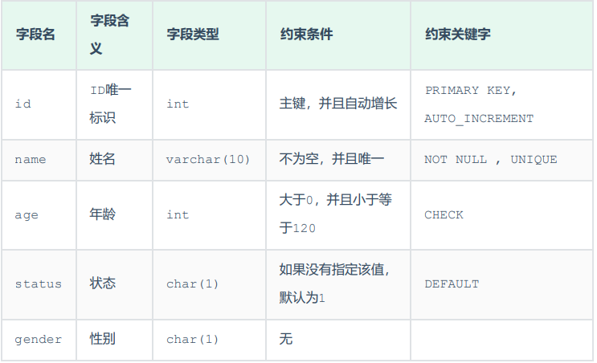
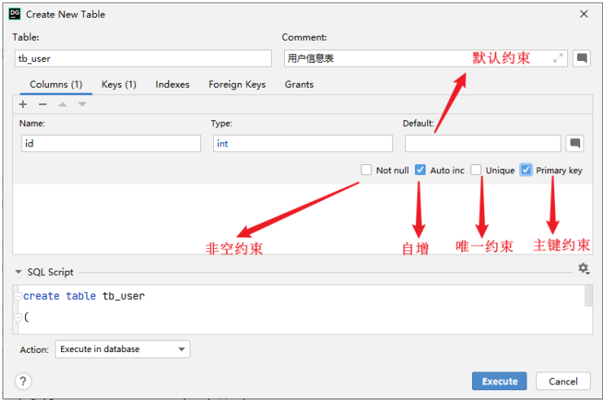

# 4、约束

## 1、概述

概念：约束是作用于表中字段上的规则，用于限制存储在表中的数据。
目的：保证数据库中数据的正确、有效性和完整性。
分类:

| 约束               | 描述                           | 关键字           |
| ---------------- | ---------------------------- | ------------- |
| 非空约束             | 限制该字段的数据不能为null              | NOT NULL      |
| 唯一约束             | 保证该字段的所有数据都是唯一、不重复的          | UNIQUE        |
| 主键约束             | 主键是一行数据的唯一标识，要求非空且唯一         | PRIMARY   KEY |
| 默认约束             | 保存数据时，如果未指定该字段的值，则采用默认值      | DEFAULT       |
| 检查约束(8.0.16版本之后) | 保证字段值满足某一个条件                 | CHECK         |
| 外键约束             | 用来让两张表的数据之间建立连接，保证数据的一致性和完整性 | FOREIGN   KEY |

注意：约束是作用于表中字段上的，可以在创建表/修改表的时候添加约束。
 

##  2、演示

​	根据需求，完成表结构的创建。需求如下：




对应的建表语句为：

```
CREATE TABLE tb_user(
id int AUTO_INCREMENT PRIMARY KEY COMMENT 'ID唯一标识',
name varchar(10) NOT NULL UNIQUE COMMENT '姓名' ,
age int check (age > 0 && age <= 120) COMMENT '年龄' ,
status char(1) default '1' COMMENT '状态',
gender char(1) COMMENT '性别'
);
```



## 3、外键约束

### 1、介绍

**外键：用来让两张表的数据之间建立连接，从而保证数据的一致性和完整性。**

### 2、语法

#### 1). 添加外键

```
CREATE TABLE 表名(
字段名 数据类型,
...
[CONSTRAINT] [外键名称] FOREIGN KEY (外键字段名) REFERENCES 主表 (主表列名)
);
```

```
ALTER TABLE 表名 ADD CONSTRAINT 外键名称 FOREIGN KEY (外键字段名)
REFERENCES 主表 (主表列名) ;
```

案例:
为emp表的dept_id字段添加外键约束,关联dept表的主键id。

```
alter table emp add constraint fk_emp_dept_id foreign key (dept_id) references
dept(id);
```

添加了外键约束之后，我们再到dept表(父表)删除id为1的记录，然后看一下会发生什么现象。 此时
将会报错，不能删除或更新父表记录，因为存在外键约束。

#### 2). 删除外键

```mysql
ALTER TABLE 表名 DROP FOREIGN KEY 外键名称;
```

案例：
删除emp表的外键fk_emp_dept_id。

```mysql
alter table emp drop foreign key fk_emp_dept_id;
```

### 3、删除/更新行为

添加了外键之后，再删除父表数据时产生的约束行为，我们就称为删除/更新行为。具体的删除/更新行
为有以下几种:

| 行为         | 说明                                       |
| ---------- | ---------------------------------------- |
| NOACTION   | 当在父表中删除/更新对应记录时，首先检查该记录是否有对应外键，如果有则不允许删除/更新。 (与 RESTRICT 一致) 默认行为 |
| RESTRICT   | 当在父表中删除/更新对应记录时，首先检查该记录是否有对应外键，如果有则不允许删除/更新。 (与 NO ACTION 一致) 默认行为 |
| CASCADE    | 当在父表中删除/更新对应记录时，首先检查该记录是否有对应外键，如果有，则也删除/更新外键在子表中的记录。 |
| SET NULL   | 当在父表中删除对应记录时，首先检查该记录是否有对应外键，如果有则设置子表中该外键值为null（这就要求该外键允许取null）。 |
| SETDEFAULT | 父表有变更时，子表将外键列设置成一个默认的值 (Innodb不支持)       |

具体语法为:

```mysql
ALTER TABLE 表名 ADD CONSTRAINT 外键名称 FOREIGN KEY (外键字段) REFERENCES
主表名 (主表字段名) ON UPDATE CASCADE ON DELETE CASCADE;
```

演示:

1). CASCADE

```
alter table emp add constraint fk_emp_dept_id foreign key (dept_id) references
dept(id) on update cascade on delete cascade ;
```

2). SET NULL

```
alter table emp add constraint fk_emp_dept_id foreign key (dept_id) references
dept(id) on update set null on delete set null;
```


