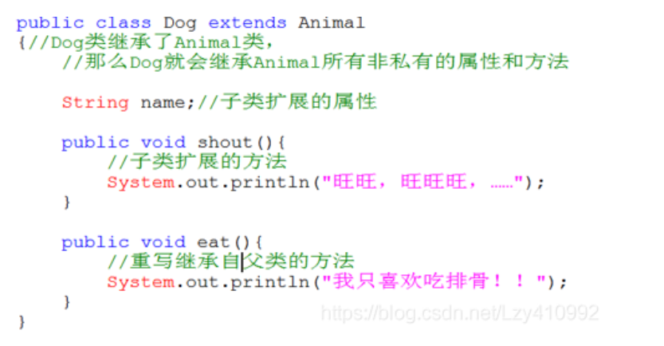
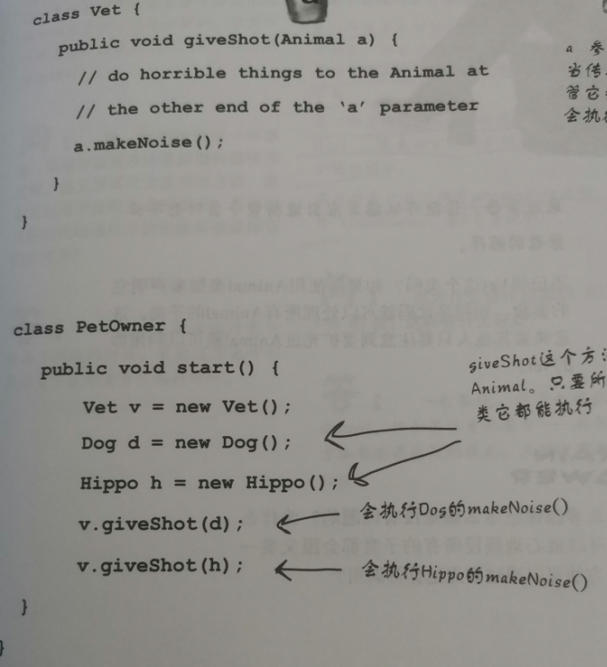

# 4、对象与类

## 1、类的声明

```java
public class 类名{
public String name;		//成员变量
public void 方法名(){
    代码块
}

}
```

## 2

```java
public 构造器名([数据类型 参数名,……]){
  //构造器完成的功能代码
}
```

1、构造器在对象创建之前执行

2、构造器名必须和类名一致

3、构造器没有返回值类型

4、任何类都含有构造器。如果没有显式地定义类的构造器，则系统会为该类提供一个默认的无参的构造器。一旦在类中显式地定义了构造器，系统就不会再为这个类提供默认的构造器了。

类的使用

```java 
对象名 = new 构造器([参数列表]);
如输入对象的创建：
Scanner input = new Scanner(System.in);
```

属性和方法的调用：

```java 
对象名.方法名();
```

## 3、方法重载

方法重载: 同一个类中定义了多个方法名相同而参数不同的方法重载在同一个类中，方法名相同，参数不同（参数的个数、顺序、类型不同）

构造器重载同上

## 4、方法的返回值类型：

```
无返回值类型：void，return;//结束方法体
有返回值类型为：数据类型(基本数据类型、引用数据类型)，return 数据;//结束方法体，并且返回一条数据，也可以不返回数据
```

## 5、this的两种使用方法：

如果发生局部变量和成员变量命名冲突时，可以通过this.成员变量名的方式区分成员变量和局部变量。

一个构造方法中需要调用本类的另一个构造方法，可以通过this()的方式调用，但this()必须要书写在第一行。

## 6、super：

super代表的是父类对象

```java
super.属性名
super.方法名();
super([参数列表])  //用于在子类的构造方法中调用父类的构造方法
```

## 7、final关键字：

​		1、修饰类：类不能继承，final 类中的所有成员方法都会被隐式的指定为 final 方法；

​		2、修饰符变量：该变量为常量，，如果是基本数据类型的变量，则其数值一旦在初始化之后便不能更改；如果是引用类型的变量，则在对其初始化之后便不能让其指向另一个对象。

​		3、修饰符方法：方法不能重写

## 8、访问修饰符

| 修饰符       | 访问范围              | 是否能被继承    |
| --------- | ----------------- | --------- |
| private   | 本类内部              | 不能被继承     |
| (default) | 本类内部+同包其他类        | 能被同包的子类继承 |
| protected | 本类内部+同包其他类+非同包的子类 | 能被继承      |
| public    | 公开能被所有类访问         | 能被继承      |

## 9、JAVA的三大特性

#### 一、封装

​		封装指隐藏对象的状态信息（属性），不允许外部对象直接访问对象的内部信息（private实现）。但是可以提供一些可以被外界访问的方法来操作属性。

​		将类中成员变量private，提供public的get和set方法来控制属性的存取动作，以保证对私有属性操作的安全性

#### 二、继承

​		继承extends：多个类中存在相同属性和行为时，将这些内容抽取到单独一个类中，那么多个类无需再定义这些属性和行为，只要继承单独的那个类即可。

```java 
public class 子类名 extends 父类名{
   类体部分
}
```

方法的重写：

```
	子类从父类继承的某个实例方法无法满足子类的功能需要时，需要在子类中对该实例方法进行重新实现，这样的过程称为重写，也叫做覆写、覆盖。
```

​		方法重写的前提：继承，子类的修饰符大于等于父类，方法名、参数列表、返回值类型必须相同



#### 三、多态

​		多态：一种事物的多种形态

​		即在创建完对象后可以通过其他类里的方法实现对不同对象里的同一种方法的调用




## 