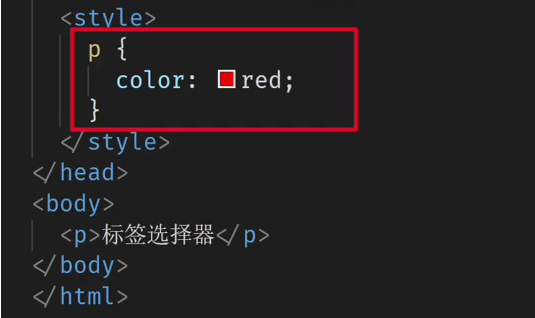
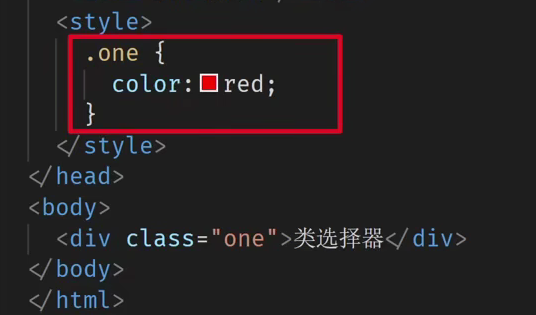
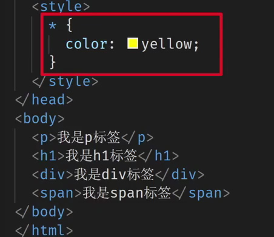
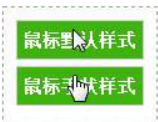
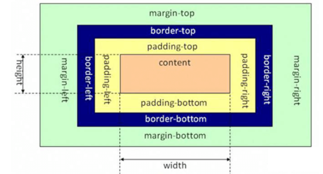

CSS即层叠样式表,用来控制网页的外观。

HTML、CSS和JavaScript的关系如下：

​		“HTML是网页的结构，CSS是网页的外观，而JavaScript是页面的行为。”

display :none   不让元素显示

## 1.CSS的引入方式

#### 一、外部样式表

​	外部样式表在单独文件中定义，并且在标签对中使用link标签来引用。一般情况下，为了提升网站的性能和维护性，都是使用外部样式表。

例：

```html
<!DOCTYPE html>
 <html>
 <head> 
 <title></title>
    <!--在HTML页面中引用文件名为index的css文件,在此需要相对路径-->
    <!--rel=stylesheet指定一个固定或首选的样式，定义一个外部加载的样式表-->
    <!--type="text/css"是指定MIME类型，其中:
	text是指对象为网页中的文本
	css或是javascript是指当前指定的文本类型-->
     
<link href="index.css" rel="stylesheet" type="text/css" />
</head>
<body>   
     <div></div>
</body>
</html>
```

#### 二、内部样式表

​	内部样式：指的就是把CSS代码和HTML代码放在同一个文件中，其中CSS代码放在标签对是放在标签对内的。

​	**style可以写在任意位置，但通常约定写在head中。**

例：

```html
<!DOCTYPE html>
<html>
<head>  
  <title></title>    
  <!--这是内部样式表，CSS样式在style标签中定义-->    
  <style type="text/css">
          p{color:Red;}      
   </style>
 </head>
 <body>   
  <p>内部样式表</p>  
 </body>
```

#### 三、内联样式表

​	内联样式表：也是把CSS代码和HTML代码放在同一个文件中，但是跟内部样式表不同，CSS样式不是在<style></style>标签对中定义，而是在标签的style属性中定义。

例：

```html
<!DOCTYPE html> 
<html>
<head>
    <title></title>
</head>
<body>
    <p style="color:Red; ">内联样式表</p>
</body>
</html>
```

## 2.元素的id和class

​		id属性：id属性被赋予了标识页面元素的唯一身份。**在同一个HTML页面中，不允许出现两个相同的id**,但在不同页面是可以出现相同id的元素。

​		class属性：我们可以为同一个页面的相同元素或者不同元素设置相同的class（即：**一个标签可以同时定义多个class**），然后使得相同的class具有相同的CSS样式。如果你要为两个元素或者两个以上元素定义相同的样式，建议使用class属性。

## 3.CSS选择器

#### 一、标签选择器

​		**结构：标签名{属性名：属性值；属性名：属性值；}**

​		作用：通过标签名找到页面中所有的这类标签，然后设置样式。




#### 二、类选择器

​		**结构：.类名{属性名：属性值；属性名：属性值；}**

​		作用：通过类名找到所有带这个类名的标签，然后设置样式。



#### 三、id选择器

​		**结构：#id属性值{属性名：属性值；属性名：属性值；}**

​		作用：通过id属性值找到所有带这个id属性值的标签，然后设置样式。


#### 四、通配符选择器

​		结构：*{属性名：属性值；属性名：属性值；}

​		作用：找到页面中所有的标签，然后设置样式。



## 4.字体

​		如果给同一个标签设置了相同的属性，此时样式会层叠（覆盖)，写在最下面的会生效

即：

​			<u>**层叠性：后面的覆盖前面的属性**</u>

#### 一、字体类型font-family

语法：

```css
font-family:字体名;
```

说明：

​		字体名指的是“微软雅黑”、“宋体”、“Times New Roman”等。

例：

​		“font-family:微软雅黑;”

#### 二、字体大小font-size

语法：

```css
font-size:像素值;
```

说明：

​		使用像素、百分比来作为单位。

例：

​		“font-size:15px;”

#### 三、字体颜色color

语法：

```css
color:关键字/颜色值;
```

说明：

​		color共有2种取值，一种是关键字取值，例如“color:red;”；另外一种是十六进制颜色值，例如“color:#F1F1F1;”。

例：

​		“color:blue;”

#### 四、字体粗细font-weight

语法：

```css
font-weight:取值;
```

说明：

​		对于中文网页来说，font-weight属性一般仅用到bold、normal这两个属性值完全就可以了，粗细值不建议使用数值（100~900）。

例：

​		“font-weight:bold;”

#### 五、字体斜体font-style

​		在CSS中，使用font-style属性来定义字体倾斜效果

语法：

```css
font-style:取值;
```

说明：

​		font-style属性的取值如下表：

| **font-style属性值** | **说明**                                |
| ----------------- | ------------------------------------- |
| normal            | 默认值，正常体                               |
| italic            | 斜体，这是一个属性                             |
| oblique           | 将字体倾斜，将没有斜体变量（italic）的特殊字体，要应用oblique |

例：

​		“font-style:italic;”

#### 六、font连写

语法：

```css
font：style weight size family;    中间用空格隔开
```

​		顺序为：字体倾斜效果、粗细、大小、类型

​		前两个可以省略，省略后为默认值

## 5.文本

#### 一、text-decoration属性（下划线）

​		定义字体下划线、删除线和顶划线。

语法：

```css
text-decoration:属性值;
```

说明：

​		text-decoration属性取值如下表：

| **text-decoration属性值** | **说明**                             |
| ---------------------- | ---------------------------------- |
| text-decoration        | 下划线、删除线、顶划线                        |
| none                   | 默认值，可以用这个属性值也可以去掉已经有下划线或删除线或顶划线的样式 |
| underline              | 下划线                                |
| line-through           | 删除线                                |
| overline               | 顶划线                                |

#### 二、首行缩进

​		text-indent属性控制文本首行的缩进。

语法：

```css
text-indent:像素值;
```

​		一个字符大小为：16px

#### 三、对齐方式

​		text-align属性控制文本的水平方向的对齐方式：左对齐、居中对齐、右对齐。

语法：

```css
text-align:属性值;
```

说明：

​		text-align属性取值如下表：

| **text-align属性** | **说明**  |
| ---------------- | ------- |
| left             | 默认值，左对齐 |
| center           | 居中对齐    |
| right            | 右对齐     |

#### 四、行高

​		line-height属性指的是行高，而不是行间距。

语法：

```css
line-height:像素值/字号的倍数;
```

#### 五、转换文本的大小写

​		text-transform属性转换文本的大小写，这个是针对英文而言，因为中文不存在大小写之分。

语法：

```css
text-transform:属性值;
```

说明：

​		text-transform属性取值如下表：

| **text-transform属性值** | 说明                       |
| --------------------- | ------------------------ |
| none                  | 默认值，无转换发生                |
| uppercase             | 转换成大写                    |
| lowercase             | 转换成小写                    |
| capitalize            | 将每个英文单词的首字母转换成大写，其余无转换发生 |

#### 六、font-variant属性

​		只有一个作用：把文本设置成小型大写字母，这也是针对英文而言，因为中文不存在大小写之分。

语法：

```css
font-variant：normal/small-caps;
```

说明：

​		font-variant属性取值如下表：

| **font-variant属性值** | 说明        |
| ------------------- | --------- |
| normal              | 默认值，正常效果  |
| small-caps          | 小型大写字母的字体 |

## 6、边框

#### 一、边框属性

| 属性                            | 说明    |
| ----------------------------- | ----- |
| border-width：像素值              | 边框的宽度 |
| border-style：一般使用solid和dashed | 边框的外观 |
| border-color：颜色值              | 边框的颜色 |

​		**简洁写法：border：width style color；**

#### 二、边框局部样式

​		1、上边框border-top

​		2、下边框border-bottom

​		3、左边框border-left

​		4、右边框border-right

## 7、背景

#### 一、颜色

​		background-color属性来定义元素的背景颜色。

语法：

```css
background-color:颜色值;
```

#### 二、背景图片

​		background-image属性来定义元素的背景图片。

语法：

```css
background-image:url("图像地址");
```

说明：

​		图像地址可以是相对地址，也可以是绝对地址。

#### 三、图像平铺

​		background-repeat属性可以设置背景图像是否平铺，并且可以设置如何平铺。

语法：

```css
background-repeat:取值;
```

说明：

​		background-repeat属性取值如下：

| **属性值**   | **说明**                       |
| --------- | ---------------------------- |
| no-repeat | 表示不平铺                        |
| repeat    | 默认值，表示在水平方向（x轴）和垂直方向（y轴）同时平铺 |
| repeat-x  | 表示在水平方向（x轴）平铺                |
| repeat-y  | 表示在垂直方向（y轴）平铺                |

#### 四、背景位置

**1、background-position取值为“像素值”**

​		background-position取值为像素值时，要设置水平方向数值（x轴）和垂直方向数值（y轴）。

**2、background-position取值为“关键字”**

​		当background-position取值为关键字时，也需要设置水平方向和垂直方向的值，只不过值不是使用px为单位的数值，而是使用关键字代替。

| **属性值**       | 说明   |
| ------------- | ---- |
| top left      | 左上   |
| top center    | 靠上居中 |
| top right     | 右上   |
| left center   | 靠左居中 |
| center center | 正中   |
| right center  | 靠右居中 |
| bottom left   | 左下   |
| bottom center | 靠下居中 |
| bottom right  | 右下   |

#### 五、背景是否随对像滚动

​		background-attachment可以设置背景图像是随对象滚动还是固定不动。

语法：

```css
background-attachment:scroll/fixed;
```

说明：

​		background-attachment 属性只有2个属性值。scroll表示背景图像随对象滚动而滚动，是默认选项；fixed表示背景图像固定在页面不动，只有其他的内容随滚动条滚动。

## 8、超链接

一、去除超链接下划线：text-decoration:none;

二、定义超链接伪类

| 属性        | 说明           |
| --------- | ------------ |
| a:link    | 定义a元素未访问时的样式 |
| a:visited | 定义a元素访问后的样式  |
| a:hover   | 定义鼠标经过显示的样式  |
| a:active  | 定义鼠标单击激活时的样式 |

例：

```css
        a{text-decoration:none;color:purple}
        a:hover{color:white}
        #div1:hover{background-color: #286E0A;}
        img:hover{border:1px solid red;}
```

## 9、鼠标样式

​		cursor属性来定义鼠标的样式。

语法：

```css
cursor:属性值;
```

例：

```css
        #div_default{cursor:default;}

        #div_pointer{cursor:pointer;}
```



## 10、图片样式

​		图片大小width和height

#### 一、图片水平对齐text-align

语法：

```css
text-align:属性值;
```

说明：

​		text-align属性取值如下表：

| **text-align属性值** | **说明**  |
| ----------------- | ------- |
| left              | 默认值，左对齐 |
| center            | 居中对齐    |
| right             | 右对齐     |

#### 二、图片垂直对齐vertical-align属性

语法：

```css
vertical-align:属性值;
```

说明：

​		vertical即“垂直的”，align即“使排整齐”。vertical-align属性取值如下表：

| **vertical-align属性取值** | **说明** |
| ---------------------- | ------ |
| top                    | 顶部对齐   |
| middle                 | 中部对齐   |
| baseline               | 基线对齐   |
| bottom                 | 底部对齐   |

## 11、文字环绕效果

#### 一、浮动属性

​		使用浮动属性float可以设置文字在某个元素的周围，它能应用于所有的元素。

语法：

```css
float:取值;
```

说明：

​		float属性的取值很简单也很容易记忆，就2个属性值：

| **float属性值** | **说明** |
| ------------ | ------ |
| left         | 元素向左浮动 |
| right        | 元素向右浮动 |

#### 二、图片与文字的间距

​		margin属性包括margin-top（上外边距）、margin-bottom（下外边距）、margin-left（左外边距）、margin-right（右外边距）。

#### 三、列表

| **list-style-type属性值** | 说明               |
| ---------------------- | ---------------- |
| decimal                | 默认值，数字1、2、3……    |
| lower-roman            | 小写罗马数字i、ii、iii…… |
| upper-roman            | 大写罗马数字I、II、III…… |
| lower-alpha            | 小写英文字母a、b、c……    |
| upper-alpha            | 大写英文字母A、B、C……    |
| disc                   | 默认值，实心圆“●”       |
| circle                 | 空心圆“○”           |
| square                 | 实心正方形“■”         |


#### 四、表格

##### 边框合并 

语法：

```css
border-collapse:属性值;
```

说明：

​		border-collapse是表格独有的属性。除了表格，在其他地方是用不上的。border-collapse属性取值如下：

| **border-collapse属性值** | **说明**            |
| ---------------------- | ----------------- |
| separate               | 默认值，边框分开，不合并      |
| collapse               | 边框合并，如果相邻，则共用一个边框 |

##### 边框间距

​		border-spacing属性来定义表格边框间距。

语法：

```css
border-spacing:像素值;
```

说明：

​		该属性指定单元格边界之间的距离。当只指定了1个像素值时，这个值将作用于横向和纵向上的间距；当指定了2个length值时，第1个作用于横向间距，第2个作用于纵向间距。

例：

​		"border-spacing:5px 10px"定义了单元格之间水平方向的间距为5px，垂直方向的间距为10px。

##### 标题位置

​		caption-side属性来定义表格标题的位置。

语法：

```css
caption-side:属性值;
```

说明：

​		top 	 默认值，标题在顶部

​		bottom               标题在底部

## 12、盒子模型



#### 一、宽度width和高度height

语法：

```css
width：像素值;
height：像素值;
```

​		只有块元素(例：div)能设置width和height，行内元素无法设置width和height。

#### 二、边框

语法：

```css
border:像素值 边框类型 颜色值
```

说明：

​		两个属性值之间一定要用空格隔开。

​		边框类型一般使用solid和dashed

#### 三、 内边距

​		内边距padding，又常常称为“补白”，它指的是内容区到边框之间的那一部分。

语法：

```css
padding-top:像素值;

padding-right:像素值;

padding-bottom:像素值;

padding-left:像素值;

```

**简洁写法**

```css
padding:像素值;

padding:像素值1 像素值2;

padding:像素值1 像素值2 像素值3 像素值4;
```

例：

​		“padding:20px;”表示四个方向的内边距都是20px；

​		“padding:20px 40px;”表示padding-top和padding-bottom为20px，padding-right和padding-left为40px。

​		“padding:20px 40px 60px 80px;”表示padding-top为20px，padding-right为40px，padding-bottom为60px，padding-left为80px。

#### 四、外边距

语法：

```css
margin-top:像素值;

margin-right:像素值;

margin-bottom:像素值;

margin-left:像素值;
```

**简洁写法**

```css
margin``:像素值;
margin``:像素值``1` `像素值``2``;
margin``:像素值``1` `像素值``2` `像素值``3` `像素值``4``;
```

例：

​		“margin:20px;”表示四个方向的外边距都是20px；

​		“margin:20px 40px;”表示margin-top和margin-bottom为20px，margin-right和margin-left为40px。

​		“margin:20px 40px 60px 80px;”表示margin-top为20px，margin-right为40px，margin-bottom为60px，margin-left为80px。

## 13、浮动布局

语法：

```css
float:取值;
```

说明：left	元素向左浮动

​            right   元素向右浮动

**清除浮动**

语法：

```css
clear:取值;
```

说明：

| **clear属性值** | 说明       |
| ------------ | -------- |
| left         | 清除左浮动    |
| right        | 清除右浮动    |
| both         | 左右浮动一起清除 |

## 14、定位布局

#### 一、固定定位

​		在视野中，固定定位的元素的位置不会改变。

语法：

```css
position:fixed;			/*设置元素为固定定位*/

top:像素值;

bottom:像素值;

left:像素值;

right:像素值;
```

#### 二、相对定位

​		相对定位是通过将元素从原来的位置向上、向下、向左或者向右移动来定位。**<u>相对于原来自己的位置进行定位，原来的位置仍然占位</u>**

语法：

```css
position:relative;

top:像素值;

bottom:像素值;

left:像素值;

right:像素值;
```

#### 三、绝对定位

​		**这种方法能够很精确地把元素移动到任意你想要的位置，所以在几种定位方法中绝对定位使用最为广泛**

语法：

```css
position:absolute;

top:像素值;

bottom:像素值;

left:像素值;

right:像素值;
```

