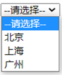

# HTML提升 - 02

## 1.列表

## 1.1 无序列表

```
`<ul>`：定义无序列表，并且只能包含`<li>`子元素。
`<li>`：定义列表项，可以包含与`<div>`完全类似的内容，所以可以包含较多类型的子元素。
```

 

单词缩写:

ul是unordered lists的缩写 (无序列表) 

 li是list item的缩写 （列表项目）

```html
<ul>
    <li>无序列表项</li>
    <li>无序列表项</li>
    <li>无序列表项</li>
</ul> 
```

> 注意：
> ```
> <ul></ul>`中只能嵌套`<li></li>`，直接在`<ul></ul>`标签中输入其他标签或者文字的做法是不被允许的。
>
> <li>`与`</li>`之间相当于一个容器，可以容纳所有元素。
> ```
>
> 


## 1.2 有序列表

有序列表即为有排列顺序的列表，其各个列表项按照一定的顺序排列定义，有序列表的基本语法格式如下：

单词缩写:

ol是ordered lists的缩写（有序列表） 

 li是list item的缩写 （列表项目）

```html
<ol>
  <li>列表项1</li>
  <li>列表项2</li>
  <li>列表项3</li>
  ......
</ol>
```

- ```
  - 所有特性基本与ul 一致。  
  - 但是实际工作中， 较少用 ol ，因此我们用一句话来总结下 ol：
  - 有序列表中默认的type类型是数字，而且是从1开始的。它有两个属性：type、start。  
  - type：有五个属性值：1、a、A、i、I(罗马数字)，表示列表前缀的格式； 
  - start：属性值位数字， 表示从type类型的第几个数字开始，比如当你选的type=“a”,start=“3”。
  ```

  ​

## 1.3 自定义列表


```
`<dl>`：定义列表
`<dt>`：定义 标签定义了定义列表中的项目(术语)
`<dd>`：定义描述
```

单词缩写:
dl是definition lists的英文缩写 (自定义列表)
dt是definition term的缩写 (自定义列表项)
dd是definition description的缩写（自定义列表描述）

```html
<dl>
    <dt>支付方式</dt>
    <dd>货到付款</dd>
    <dd>在线支付</dd>
    <dd>分期付账</dd>
</dl>
```

## 1.4 列表总结

| 标签名       |  定义   | 说明                             |
| --------- | :---: | :----------------------------- |
| <ul></ul> | 无序标签  | 里面只能包含li    没有顺序，我们以后布局中最常用的列表 |
| <ol></ol> | 有序标签  | 里面只能包含li    有顺序， 使用情况较少        |
| <dl></dl> | 自定义列表 | 里面有2个兄弟， dt 和 dd               |

## 1.5  图片、音频、视频标签


- ```
  - img：定义图片
    - src：规定显示图像的 URL（统一资源定位符）
    - height：定义图像的高度
    - width：定义图像的宽度
  - audio：定义音频。支持的音频格式：MP3、WAV、OGG 
    - src：规定音频的 URL
    - controls：显示播放控件
  - video：定义视频。支持的音频格式：MP4, WebM、OGG
    - src：规定视频的 URL
    - controls：显示播放控件
  ```

  ​

**尺寸单位：**

height属性和width属性有两种设置方式：

- 像素：单位是px
- 百分比。占父标签的百分比。例如宽度设置为 50%，意思就是占它的父标签宽度的一般（50%）

**资源路径：**

图片，音频，视频标签都有src属性，而src是用来指定对应的图片，音频，视频文件的路径。此处的图片，音频，视频就称为资源。资源路径有如下两种设置方式：

- 绝对路径：完整路径

  这里的绝对路径是网络中的绝对路径。 格式为： 协议://ip地址:端口号/资源名称。

  如：

  ```
  
  ```

  这里src属性的值就是网络中的绝对路径。

- 相对路径：相对位置关系

  找页面和其他资源的相对路径。

  > ./    表示当前路径
  >
  > ../   表示上一级路径
  >
  > ../../   表示上两级路径

  如模块目录结构如下：

  

  在 `01-基础标签.html` 里的标签中找不同的图片，路径写法不同

  ```html
  <!--在该页面找a.jpg，就需要先回到上一级目录，该级目录有img目录，进入该目录就可以找到 a.jpg图片-->
  
  <!--该页面和aa.jpg 是在同一级下，所以可以直接写 图片的名称，也可以写成  ./aa.jpg-->
  
  ```

使用这些标签的代码如下：

```html

<audio src="b.mp3" controls></audio>
<video src="c.mp4" controls width="500" height="300"></video>
```

在浏览器展示的效果如下：


### 

## 1.6  表单标签

表单标签效果大家其实都不陌生，像登陆页面、注册页面等都是表单。


像这样的表单就是用来采集用户输入的数据，然后将数据发送到服务端，服务端会对数据库进行操作，比如注册就是将数据保存到数据库中，而登陆就是根据用户名和密码进行数据库的查询操作。

表单是很重要的标签，需要大家重点来学习。

### 1.6.1  表单标签概述

> ```
> 表单：在网页中主要负责数据采集功能，使用<form>标签定义表单
>
> 表单项(元素)：不同类型的 input 元素、下拉列表、文本域等
> ```
>
> 


`form` 是表单标签，它在页面上没有任何展示的效果。需要借助于表单项标签来展示不同的效果。如下图就是不同的表单项标签展示出来的效果。


### 1.6.2  form标签属性

```
**action：规定当提交表单时向何处发送表单数据，该属性值就是URL**
```


```
以后会将数据提交到服务端，该属性需要书写服务端的URL。而今天我们可以书写 `#` ，表示提交到当前页面来看效果。
```


- ```
  **method ：规定用于发送表单数据的方式**

  method取值有如下两种：

  get：默认值。如果不设置method属性则默认就是该值

  - 请求参数会拼接在URL后边
  - url的长度有限制 4KB

  post：

  - 浏览器会将数据放到http请求消息体中
  - 请求参数无限制的
  ```

  ​

### 1.6.3  代码演示

由于表单标签在页面上没有任何展示的效果，所以在演示的过程是会先使用 `input` 这个表单项标签展示输入框效果。

代码如下：

```html
<!DOCTYPE html>
<html lang="en">
<head>
    <meta charset="UTF-8">
    <title>Title</title>
</head>
<body>
    <form>
        <input type="text">
        <input type="submit">
    </form>
</body>
</html>
```

浏览器展示效果如下：

 

```
从效果可以看到页面有一个输入框，用户可以在数据框中输入自己想输入的内容，点击提交按钮以后会将数据发送到服务端，当然现在肯定不能实现。现在我们可以将 `form` 标签的 `action` 属性值设置为 `#` ，将其将数据提交到当前页面。还需要注意一点，要想提交数据，`input` 输入框必须设置 `name` 属性。代码如下：
```


```html
<!DOCTYPE html>
<html lang="en">
<head>
    <meta charset="UTF-8">
    <title>Title</title>
</head>
<body>
    <form action="#">
        <input type="text" name="username">
        <input type="submit">
    </form>
</body>
</html>
```

浏览器展示效果如下：

 

在输入框输入 `hehe` ，然后点击 `提交` 按钮，就能看到如下效果

 

```
我们可以看到在浏览器的地址栏的URL后拼接了我们提交的数据。`username` 就是输入框 `name` 属性值，而 `hehe` 就是我们在输入框输入的内容。
```


```
接下来我们来聊 `method` 属性，默认是 `method = 'get'`，所以该取值就会将数据拼接到URL的后面。那我们将 `method` 属性值设置为 `post`，浏览器的效果如下：
```

 

从上图可以看出数据并没有拼接到 URL 后，那怎么看提交的数据呢？我们可以使用浏览器的开发者工具来查看


按照如上步骤操作能看到如下页面


重新提交数据后，可以看到提交的数据，如下图


## 1.7  表单项标签

表单项标签有很多，不同的表单项标签有不同的展示效果。表单项标签可以分为以下三个：

- ```
  \<input>：表单项，通过type属性控制输入形式

  `input` 标签有个 `type` 属性。 `type` 属性的取值不同，展示的效果也不一样
  ```

  


- ```
  <select>：定义下拉列表，\<option> 定义列表项 

  如下图就是下拉列表的效果：
  ```

   

- ```
  <textarea>：文本域

  如下图就是文本域效果。它可以输入多行文本，而 `input` 数据框只能输入一行文本。
  ```

   

> ==注意：==
>
> - 以上标签项的内容要想提交，必须得定义 `name` 属性。
> - 每一个标签都有id属性，id属性值是唯一的标识。
> - 单选框、复选框、下拉列表需要使用 `value` 属性指定提交的值。

**代码演示：**

```html
<!DOCTYPE html>
<html lang="en">
<head>
    <meta charset="UTF-8">
    <title>Title</title>
</head>
<body>
    <form action="#" method="post">
        <input type="hidden" name="id" value="123">

        <label for="username">用户名：</label>
        <input type="text" name="username" id="username"><br>

        <label for="password">密码：</label>
        <input type="password" name="password" id="password"><br>

        性别：
        <input type="radio" name="gender" value="1" id="male"> <label for="male">男</label>
        <input type="radio" name="gender" value="2" id="female"> <label for="female">女</label>
        <br>

        爱好：
        <input type="checkbox" name="hobby" value="1"> 旅游
        <input type="checkbox" name="hobby" value="2"> 电影
        <input type="checkbox" name="hobby" value="3"> 游戏
        <br>

        头像：
        <input type="file"><br>

        城市:
        <select name="city">
            <option>北京</option>
            <option value="shanghai">上海</option>
            <option>广州</option>
        </select>
        <br>

        个人描述：
        <textarea cols="20" rows="5" name="desc"></textarea>
        <br>
        <br>
        <input type="submit" value="免费注册">
        <input type="reset" value="重置">
        <input type="button" value="一个按钮">
    </form>
</body>
</html>
```

在浏览器的效果如下：


## 

